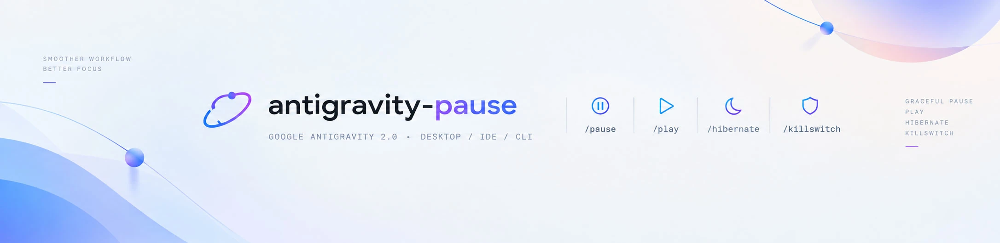

<p align="center">
  
</p>

<p align="center">
  <strong>Graceful Standby, Deep Hibernation & Pre-Flight Leak Protection Built Exclusively for Google Antigravity</strong>
</p>

<p align="center">
  <a href="LICENSE"></a>
  
  
  
  <a href="#-راهنمای-فارسی"></a>
</p>

<p align="center">
  <a href="#-quick-agent-install">Quick Install</a> •
  <a href="#-why-google-antigravity-needs-this">Why Antigravity Needs This</a> •
  <a href="#-how-antigravity-pause-works">Architecture</a> •
  <a href="#-slash-commands-in-antigravity">Commands</a> •
  <a href="#-hardware-firewall-kill-switch">Kill Switch</a> •
  <a href="#-cli-reference">CLI</a> •
  <a href="#-راهنمای-فارسی">راهنمای فارسی</a>
</p>

---

<a id="quick-agent-install"></a>
## ⚡ Quick Agent Install

Install in 1 step by pasting this prompt directly into your Antigravity chat:

> **Copy & Paste to Antigravity:**  
> `Please clone https://github.com/omid-io/antigravity-pause.git and run python install.py to equip Antigravity with /pause, /play, /hibernate, and /killswitch skills.`

Or run manually in your terminal:
```bash
git clone https://github.com/omid-io/antigravity-pause.git
cd antigravity-pause
python install.py
```
*(On Windows, you can also simply double-click `setup.bat`).*

---

<a id="why-google-antigravity-needs-this"></a>
## 🎯 Why Google Antigravity Needs This

Unlike simple CLI tools or stateless chat interfaces that send isolated HTTP requests, **Google Antigravity** operates as a sophisticated multi-process engine:

* **Long-Lived Streaming Sockets:** Antigravity Desktop (`Antigravity.exe`) and its background backend (`language_server.exe`) maintain continuous bidirectional gRPC and HTTP/2 streaming connections directly to Google's Gemini API endpoints (`generativelanguage.googleapis.com`).
* **Active Subagent Hierarchies:** When complex tasks run, Antigravity orchestrates concurrent subagents. If your network switches, drops, or enters laptop sleep mid-stream, these active process trees get disrupted.
* **Strict Google Regional Geoblocking:** If a VPN TUN connection drops even for 200 milliseconds, Windows immediately routes packets via the physical ISP interface. Google's front-end edge filters instantly reject Iranian IP traffic with:
  ```text
  403 Forbidden: User location is not supported for the API use
  ```
  This immediately breaks the active conversation turn, forces model errors, and can leave background tasks stuck in broken states.

| Antigravity Risk | Impact Without `antigravity-pause` | Solution With `antigravity-pause` |
| :--- | :--- | :--- |
| **VPN Switch Mid-Session** | TCP socket resets with `ECONNRESET`, dumping streaming tokens. | `/pause` puts parent & subagents in radio silence. |
| **TUN Disconnect / IP Leak** | Packets hit Google with Iran IP → immediate `403` geoblock. | `/killswitch` drops packets locally at Windows kernel level. |
| **System Sleep / Power Loss** | Context lost in RAM, uncommitted work vanished. | `/hibernate` writes atomic JSON snapshot to disk. |
| **Git Interruption** | Abandoned `.git/index.lock` locks the repository. | Automatic Git lock sanitization upon resumption. |

---

<a id="how-antigravity-pause-works"></a>
## 💡 Core Architecture

```
[Antigravity 2.0 UI / Chat]
        │
        ├──► /pause       ──► Radio silence: puts subagents into light sleep (preserves RAM state)
        ├──► /play        ──► Pre-flight probe (<200ms) tests Gemini API & GeoIP before unfreezing
        │
        ├──► /hibernate   ──► Atomic disk checkpoint + frees git locks + clean process exit
        ├──► /continue    ──► Out-of-band network check + rehydrates subagents from exact next step
        │
        └──► /killswitch  ──► Hardware firewall rule: binds Antigravity exclusively to VPN adapter.
                              If VPN drops, 0 bytes leak to local physical ISP.
```

---

<a id="slash-commands-in-antigravity"></a>
## ⚡ Slash Commands in Antigravity

Once installed, typing `/` in your Antigravity chat exposes these native skills:

| Command | Action in Antigravity | When to Use |
| :---: | :--- | :--- |
| **`/pause`** | Initiates **Hot Standby**: halts all outgoing network requests and places subagents in standby without closing processes. | When switching VPN servers, toggling Wi-Fi, or putting laptop to sleep. |
| **`/play`** | Executes `<200ms` pre-flight probe. If safe (non-IR IP), resumes execution instantly from the next pending step. | Right after your VPN reconnects to continue work. |
| **`/hibernate`** | Saves an atomic snapshot of active task, subagent states, and cleans up `.git/index.lock` before closing. | Before shutting down PC or closing Antigravity completely. |
| **`/continue`** | Rehydrates previous session state, verifies connection integrity, and resumes multi-agent workflows. | In a fresh Antigravity window after restarting your PC. |
| **`/killswitch`** | Configures Windows Firewall Outbound Block rules for Antigravity on physical network adapters. | To permanently prevent Iran IP leaks when VPN TUN drops. |

---

<a id="hardware-firewall-kill-switch"></a>
## 🛡️ Hardware Kill Switch (Optional & Manual)

The Kill Switch is **strictly manual & optional** (disabled by default). Users outside restricted countries do not need it, while developers in Iran or geo-fenced environments can toggle it on with a single command.

### How It Works Under the Hood
1. Detects `Antigravity.exe` and `language_server.exe` paths.
2. Identifies physical network adapters (`Wi-Fi`, `Ethernet`) versus virtual VPN adapters (`wintun`, `sing-tun`, `TAP`, `WireGuard`).
3. Installs Windows Defender Firewall **Outbound Block** rules on physical adapters for Antigravity binaries.
4. If your VPN connection drops unexpectedly, Windows drops outbound packets at the kernel level. **Zero bytes reach your local ISP or Google with an Iranian IP.**

```text
/killswitch status   ──► Check whether the firewall shield is active
/killswitch on       ──► Enable Outbound Block rules on Wi-Fi and Ethernet
/killswitch off      ──► Cleanly remove firewall rules and restore default routing
```

Or using desktop 1-click batch files:
* Double-click **`enable_killswitch.bat`** (requests Administrator elevation and enables rules).
* Double-click **`disable_killswitch.bat`** (removes rules).

---

<a id="cli-reference"></a>
## 🖥️ Terminal Showcase

You can run the built-in diagnostic CLI standalone or let your agents inspect it:

```text
> python cli.py probe
[OK] اتصال ایمن است (Latency: 142.1ms | IP: 185.112.82.148 | Country: FI)
-> اتصال پایدار است و شرایط برای ارسال درخواست به هوش مصنوعی ۱۰۰٪ امن می‌باشد.

> python cli.py killswitch status --json
{
  "kill_switch_enabled": true,
  "active_rules_count": 4,
  "physical_adapters": ["Ethernet", "Wi-Fi"],
  "protected_binaries": [
    "C:\\Users\\...\\Antigravity.exe",
    "C:\\Users\\...\\language_server.exe"
  ],
  "message": "کیل‌سوئیچ فایروال فعال است: ترافیک اینترنت در صورت قطع VPN از کارت شبکه فیزیکی نشت نخواهد کرد."
}
```

---

## 📂 Repository Structure

```
antigravity-pause/
├── assets/
│   └── banner.webp           # Optimized official banner (37KB WebP)
├── core/
│   ├── network_probe.py      # Sub-second (<200ms) anti-leak probe for Google AI endpoints
│   ├── engine.py             # Atomic checkpointing & state persistence
│   ├── process_guard.py      # Safe subagent freezing and git lock cleanup
│   └── kill_switch.py        # Windows Firewall Outbound Kill Switch engine
├── skills/
│   ├── pause/SKILL.md        # /pause and /play skill definitions for Antigravity
│   ├── hibernate/SKILL.md    # /hibernate and /continue skill definitions for Antigravity
│   └── killswitch/SKILL.md   # /killswitch skill definition for Antigravity
├── cli.py                    # Standalone CLI diagnostic & agent control tool
├── install.py                # Automated installer & dynamic skill linker
├── setup.bat                 # 1-click Windows installer
├── enable_killswitch.bat     # 1-click elevated Kill Switch activation
├── disable_killswitch.bat    # 1-click elevated Kill Switch deactivation
├── LICENSE                   # MIT License
└── README.md
```

---

## 📜 License

This project is licensed under the [MIT License](LICENSE). Free and open-source for all developers.

---
---

<a id="راهنمای-فارسی"></a>
## 🇮🇷 راهنمای فارسی

> **سیستم هوشمند مدیریت پاز، فریز وضعیت (چک‌پوینت)، تست سلامت اتصال، رفع نشت آی‌پی و کیل‌سوئیچ فایروال اختصاصی برای Google Antigravity (دسکتاپ ۲، IDE و CLI).**

---

### ⚡ نصب خودکار با یک دستور به ایجنت (پیشنهادی)

کافی است متن زیر را کپی کرده و در کادر چت Antigravity بفرستید:

> **متن آماده برای کپی به چت:**  
> `لطفاً ریپازیتوری https://github.com/omid-io/antigravity-pause.git را کلون کن و با اجرای دستور python install.py قابلیت‌های /pause، /play، /hibernate و /killswitch را روی سیستم من نصب و فعال کن.`

---

### 🎯 چرا نرم‌افزار Google Antigravity به این ابزار نیاز دارد؟
نرم‌افزار Antigravity بر خلاف ایجنت‌های ساده متنی، یک سیستم پیشرفته چندپروسه‌ای است:
* **سوکت‌های استریم دائمی:** نرم‌افزار Antigravity دسکتاپ (`Antigravity.exe`) و سرور پردازشی بک‌اند آن (`language_server.exe`) سوکت‌های زنده و پیوسته gRPC/HTTP-2 به سرورهای جمینای گوگل دارند.
* **ارکستراسیون ساب‌ایجنت‌ها:** در حین اجرای تسک‌های سنگین، چندین ساب‌ایجنت به صورت موازی در حال فعالیت هستند. قطع ناگهانی اینترنت این درخت پردازش را معلق می‌گذارد.
* **تحریم منطقه‌ای سخت‌گیرانه گوگل:** در صورت قطع شدن فیلترشکن TUN (حتی برای چند صد میلی‌ثانیه)، ویندوز ترافیک را فوراً روی کارت شبکه فیزیکی (مودم یا سیم‌کارت ایران) می‌اندازد. سرورهای گوگل با دریافت پکت از IP ایران بلافاصله خطای زیر را صادر کرده و سشن چت را متوقف می‌کنند:
  ```text
  403 Forbidden: User location is not supported for the API use
  ```

---

### 💡 راه‌حل‌های ۴گانه `antigravity-pause`

| قابلیت | عملکرد در Antigravity | دستور |
| :--- | :--- | :---: |
| **ایست گرم (Hot Standby)** | سکوت رادیویی و خواب سبک والد و ساب‌ایجنت‌ها بدون بستن پروسه‌ها یا هدررفت حافظه RAM. | `/pause` |
| **ادامه امن (Safe Resume)** | پروب ۲۰۰ میلی‌ثانیه‌ای سلامت اتصال و ضد نشت آی‌پی + ادامه فوری کار از گام بعدی. | `/play` |
| **خواب عمیق (Hibernation)** | ثبت اتمیک وضعیت روی دیسک، پاکسازی قفل‌های گیت و بستن تمیز برنامه‌ها. | `/hibernate` |
| **بازیابی خودکار (Restore)** | لود آخرین چک‌پوینت و ادامه پروژه دقیقاً از گام بعدی در سشن جدید. | `/continue` |
| **کیل‌سوئیچ فایروال (Kill Switch)** | مسدودسازی ترافیک Antigravity روی کارت فیزیکی جهت عدم نشت به ایران در قطع VPN. | `/killswitch` |

---

### 🛡️ نحوه فعال‌سازی دستی کیل‌سوئیچ (کاملاً اختیاری)

این ویژگی به صورت پیش‌فرض خاموش است تا برای کاربران خارج از ایران محدودیتی ایجاد نکند. برای فعال‌سازی در ایران:

* **در چت Antigravity:**
  * `/killswitch on` — فعال‌سازی سپر فایروال
  * `/killswitch off` — غیرفعال‌سازی و بازگشت به حالت عادی
  * `/killswitch status` — مشاهده وضعیت فعلی
* **فایل‌های یک‌کلیکی دسکتاپ:**
  * اجرای فایل `enable_killswitch.bat`
  * اجرای فایل `disable_killswitch.bat`
* **خط‌فرمان (مخصوص اتوماسیون):**
  ```powershell
  python cli.py killswitch status --json
  python cli.py killswitch enable
  python cli.py killswitch disable
  ```

---

### 📜 مجوز و لایسنس
این پروژه تحت پروانه [MIT License](LICENSE) منتشر شده و استفاده از آن برای تمام برنامه‌نویسان آزاد و رایگان است.
